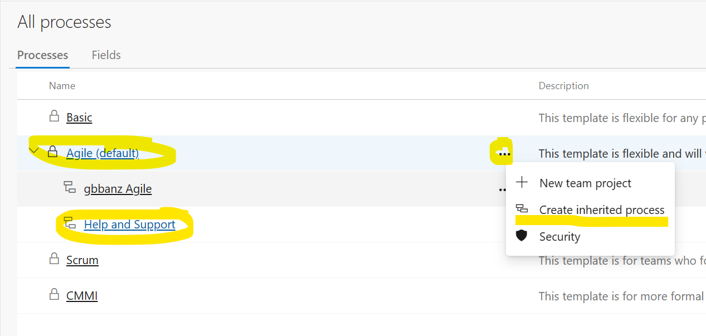
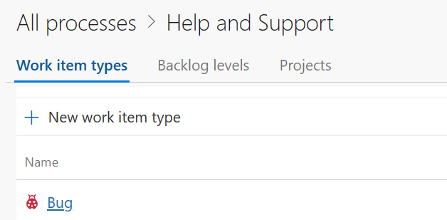
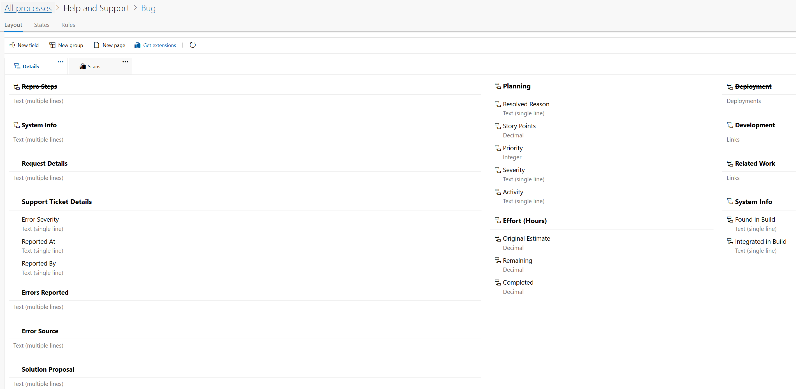
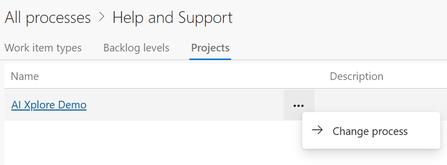

# GenAITicketing
[](https://portal.azure.com/#create/Microsoft.Template/uri/https%3A%2F%2Fraw.githubusercontent.com%2Fclarenceb%2FGenAITicketing%2Fapitoazdo%2Fdeploy%2Fdeploy.generated.json)

## Overview

This is a sample application that demonstrates how to create a simple ticketing system that allows users to submit support requests via freeform e-mail and have them automatically converted into tickets in a ticketing system. The application uses Logic Apps (Standard) for the workflow process and leverages Azure OpenAI (gpt-35-turbo-16k) to generate a structured JSON payload from the e-mail contents.  The JSON payload can then be used to integrate with ticketing systems such as ServiceNow, Jira, or any other system that accepts JSON payloads.  This sample uses **Azure DevOps** with custom fields on the **Bug** work item type.

The workflow `SupportTicketing/workflow.json` accepts an "email" as JSON via a HTTP API call in the form:

```json
{
    "from": "Margaret Wilson",
    "sent": "Thursday, November 9, 2023 1:09:17 PM",
    "to": "Support Mailbox <supportmailbox@SupportMailBox123.onmicrosoft.com>",
    "subject": "Web Issue",
    "content": "<email-body-with-the-support-request-details>"
}
```

You would need to extract the actual e-mail content and convert it to a JSON payload.

Alternatively, you can update the workflow to use a email trigger instead of a HTTP trigger, for example, using the Outlook connector.


## Setup Azure DevOps process and project

Ensure that you have an Azure DevOps Organisation and Project setup.

Naivate to the Organization Settings:


Then click the Boards / Process settings:

)

Select the default process for your organisation and choose to create an inherited process (e.g. "Help and Support") from the context menu:



Select the "Bug" work item type:



Click the "Layout" tab and then add the following custom fields and disable the others that are not needed as in the screenshot below:

* **Request** Details (multi-line text)
* **Error Severity** (single-line text)
* **Reported At** (single-line text)
* **Report By** (single-line text)
* **Errors Reported** (multi-line text)
* **Error Source** (multi-line text)
* **Solution Proposal** (multi-line text)



Save your changes.

Finally, click "Projects" tab for your custom process and click "-> Change process" from the context menu (three dots) and select your new custom process for your project and save changes.



## Setup Local Environment / VSCode

Install:

* Node v18.19.x+
* Azure Functions Core Tools 4.x
* Azure Logic Apps (Standard) extension for VSCode
* Azurite extension for VSCode (optional)
* REST Client extension for VSCode (optional)
* Bicep extension for VSCode (optional)

## Deployment

Click the **Deploy to Azure** button above to deploy the solution to your Azure subscription.

Alternatively, you can deploy the solution from the CLI:

```ps1
# Optional: Re-generate the deployment ARM template for use with GitHub "Deploy to Azure" button
cd deploy\infra\
.\generate.ps1

# Deploy the infrastructure
az login
az group create --name <resource-group-name> --location <location>
az deployment group create --resource-group <resource-group-name> --template-file .\deploy.bicep

cd ..\..

# Deploy the Logic App (Standard) workflow(s)
cd logicapps/
del logicapps.zip
zip -r logicapps.zip . -x *local.settings.json -x *azureconfig.json
az functionapp deploy --resource-group <resource-group-name> --name ticket-logicappstd --src-path logicapps.zip --type zip
```

Create a file `azureconfig.json` with the following content:

```json
{
    "WORKFLOWS_SUBSCRIPTION_ID": "<your-sub>",
    "WORKFLOWS_RESOURCE_GROUP_NAME": "<your-rg>",
    "WORKFLOWS_LOCATION_NAME": "<you-location>",
    "openAIKey": "<your-aoai-key>",
    "openAIEndpoint": "https://<your-aoai>.openai.azure.com/",
    "visualstudioteamservices-connectionKey": "<jwt-auth-token>",
    "azdoConnectionRuntimeUrl": "<your-azdoConnectionRuntimeUrl>",
    "devopsOrganisation": "<your-org>",
    "devopsProject": "<your-project>"
}
```

Apply the app settings file for the Logic App workflows:

```sh
az webapp config appsettings set -g <resource-group-name> -n ticket-logicappstd --settings @azureconfig.json
```

## Run the workflow

Post-deployment: You may need to update the Logic Apps connection for Azure DevOps as it's linked to a personal account (Managed Identity and PAT tokens are not supported).

Retrieve the Workflow URL and then make a rest call to the endpoint:

```pwsh
curl -X POST -H "Content-Type: application/json" -d @samples\email-001.json "<workflow-url>" | jq .
```

Or open the `genai-ticketing.http` file in VSCode and use the REST client extension to send the request(s):

* You'll need to create a `.env` file (see `.env-template`) with the required variables.

## Resources

* [Azure DevOps for Logic Apps (Single-tenant)](https://github.com/Azure/logicapps/blob/master/azure-devops-sample)
* [GitHub Actions for Logic Apps (Single-tenant)](https://github.com/Azure/logicapps/tree/master/github-sample)
* [Azure OpenAI and AI Search in-app connectors for Logic Apps (Standard)](https://techcommunity.microsoft.com/t5/azure-integration-services-blog/public-preview-of-azure-openai-and-ai-search-in-app-connectors/ba-p/4049584)
